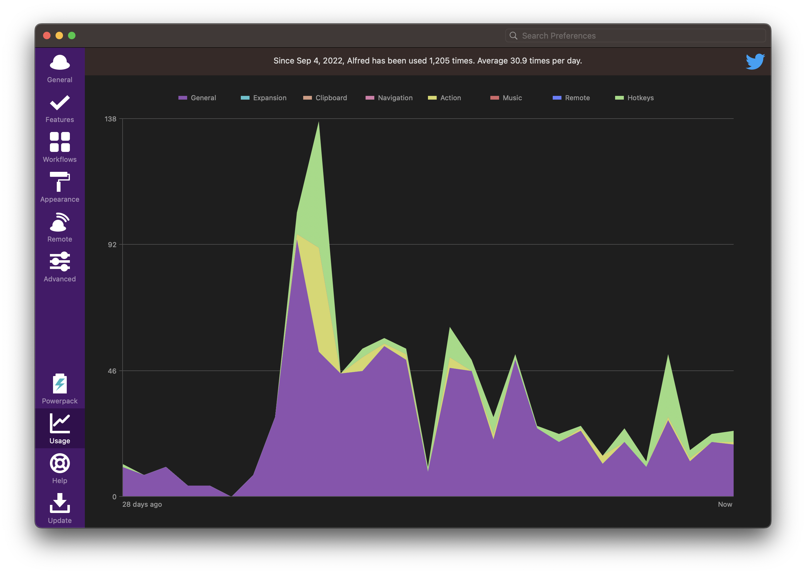

# Alfred Workflows on my macOS

- Alfred version: 5.0.3 (2087)
- Powerpack: Mega Supporter (since 2019-03-16)
- macOS version: macOS 13.0 (22A5365d)
- Mac: MacBookAir10,1(M1)

## Write by me

[App Bundle ID](./workflows/App%20Bundle%20ID.md)

## Modified from other people

[Search Unicode](./workflows-mod/Search%20Unicode.md)

[FastDiff](./workflows-mod/FastDiff.md)

## Installed

[xilopaint/alfred-about-this-mac](https://github.com/xilopaint/alfred-about-this-mac): Shows About This Mac info in Alfred.

[jsumners/alfred-emoji](https://github.com/jsumners/alfred-emoji): Alfred workflow for searching and copying emoji

## Misc

Recent Usage:

