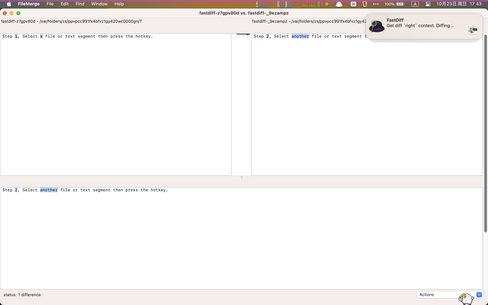

# Alfred-FastDiff

mod: upgrade to python3 and new FileMerge CLI.

original: [monkeycz/alfred-fastdiff](https://github.com/monkeycz/alfred-fastdiff)

## Usage

The default hotkey is <kbd> + \</kbd>.

Step 1, Select a file or text segment then press the hotkey.

Step 2, Select another file or text segment then press the hotkey.

Well, the FileMerge.app / vimdiff (in a new Terminal/iTerm2 tab page) will be launched  and diff your selections.

## License

GNU GPL v2

## Misc

